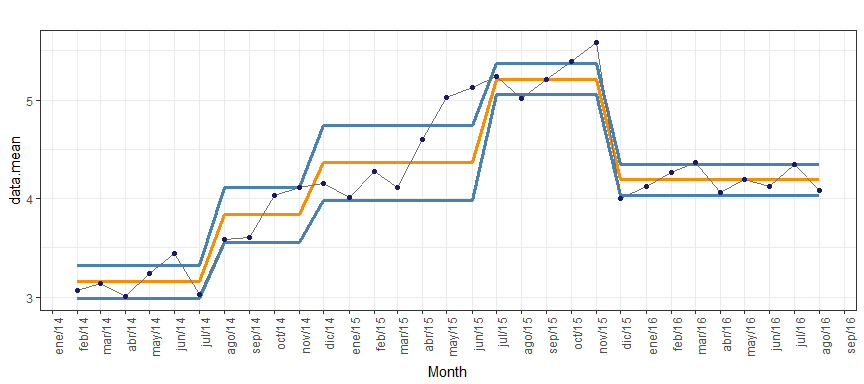

ccharter
========

Control Charts made easy. ccharter focus on calculating control systems in a time series and plotting them as an overlay to the series.

Installation
============

-   You can install from github with:

    ``` r
    if ( !("devtools" %in% installed.packages()) ) {
       install.packages("devtools")
    }
    devtools::install_github("jbaxx/ccharter")
    ```

    Using ccharter
    ==============

ccharter comes with two functions:

-   `ccpoints` to calculate Control Systems points from a time series data frame
-   `cc2plot` to plot the Control Systems points (Control Chart)

Loading the package

``` r
library(ccharter)
```

Calculating the Control Systems points

-   An example usage of `ccpoints`:

``` r
library(ccharter)
# Create a random time series
set.seed(154)
time.series <- data.frame(t.dates = seq.Date(as.Date("2014-02-01"), as.Date("2016-08-01"), "month"),
               t.values = c(
               seq(0.1, 0.8, by = 0.1) * runif(8) + 3,
               seq(0.1, 0.7, by = 0.1) * runif(7) + 4,
               seq(0.1, 0.7, by = 0.1) * runif(7) + 5,
               seq(0.1, 0.4, by = 0.1) * runif(4) + 4,
               seq(0.1, 0.5, by = 0.1) * runif(5) + 4)
               )

# Execute function
control.chart.data <- ccpoints(time.series, "t.dates", "t.values")
print(control.chart.data)
#> $data
#>       t.dates t.values data.mean  data.ll  data.ul
#> 1  2014-02-01 3.071129  3.156051 2.991715 3.320387
#> 2  2014-03-01 3.140564  3.156051 2.991715 3.320387
#> 3  2014-04-01 3.008430  3.156051 2.991715 3.320387
#> 4  2014-05-01 3.243547  3.156051 2.991715 3.320387
#> 5  2014-06-01 3.442773  3.156051 2.991715 3.320387
#> 6  2014-07-01 3.029862  3.156051 2.991715 3.320387
#> 7  2014-08-01 3.584627  3.835610 3.557910 4.113310
#> 8  2014-09-01 3.609076  3.835610 3.557910 4.113310
#> 9  2014-10-01 4.035450  3.835610 3.557910 4.113310
#> 10 2014-11-01 4.113288  3.835610 3.557910 4.113310
#> 11 2014-12-01 4.154620  4.362018 3.981592 4.742444
#> 12 2015-01-01 4.015236  4.362018 3.981592 4.742444
#> 13 2015-02-01 4.276388  4.362018 3.981592 4.742444
#> 14 2015-03-01 4.108822  4.362018 3.981592 4.742444
#> 15 2015-04-01 4.596183  4.362018 3.981592 4.742444
#> 16 2015-05-01 5.020861  4.362018 3.981592 4.742444
#> 17 2015-06-01 5.125352  4.362018 3.981592 4.742444
#> 18 2015-07-01 5.234173  5.210863 5.054793 5.366933
#> 19 2015-08-01 5.010747  5.210863 5.054793 5.366933
#> 20 2015-09-01 5.207468  5.210863 5.054793 5.366933
#> 21 2015-10-01 5.391063  5.210863 5.054793 5.366933
#> 22 2015-11-01 5.580323  5.210863 5.054793 5.366933
#> 23 2015-12-01 4.005439  4.190811 4.032753 4.348869
#> 24 2016-01-01 4.124688  4.190811 4.032753 4.348869
#> 25 2016-02-01 4.268670  4.190811 4.032753 4.348869
#> 26 2016-03-01 4.364448  4.190811 4.032753 4.348869
#> 27 2016-04-01 4.057919  4.190811 4.032753 4.348869
#> 28 2016-05-01 4.191753  4.190811 4.032753 4.348869
#> 29 2016-06-01 4.123060  4.190811 4.032753 4.348869
#> 30 2016-07-01 4.342869  4.190811 4.032753 4.348869
#> 31 2016-08-01 4.080363  4.190811 4.032753 4.348869
#> 
#> $dates.name
#> [1] "t.dates"
#> 
#> $values.name
#> [1] "t.values"
#> 
#> attr(,"class")
#> [1] "ccpoints"

# To extract only the data frame
control.chart.data[["data"]]
#>       t.dates t.values data.mean  data.ll  data.ul
#> 1  2014-02-01 3.071129  3.156051 2.991715 3.320387
#> 2  2014-03-01 3.140564  3.156051 2.991715 3.320387
#> 3  2014-04-01 3.008430  3.156051 2.991715 3.320387
#> 4  2014-05-01 3.243547  3.156051 2.991715 3.320387
#> 5  2014-06-01 3.442773  3.156051 2.991715 3.320387
#> 6  2014-07-01 3.029862  3.156051 2.991715 3.320387
#> 7  2014-08-01 3.584627  3.835610 3.557910 4.113310
#> 8  2014-09-01 3.609076  3.835610 3.557910 4.113310
#> 9  2014-10-01 4.035450  3.835610 3.557910 4.113310
#> 10 2014-11-01 4.113288  3.835610 3.557910 4.113310
#> 11 2014-12-01 4.154620  4.362018 3.981592 4.742444
#> 12 2015-01-01 4.015236  4.362018 3.981592 4.742444
#> 13 2015-02-01 4.276388  4.362018 3.981592 4.742444
#> 14 2015-03-01 4.108822  4.362018 3.981592 4.742444
#> 15 2015-04-01 4.596183  4.362018 3.981592 4.742444
#> 16 2015-05-01 5.020861  4.362018 3.981592 4.742444
#> 17 2015-06-01 5.125352  4.362018 3.981592 4.742444
#> 18 2015-07-01 5.234173  5.210863 5.054793 5.366933
#> 19 2015-08-01 5.010747  5.210863 5.054793 5.366933
#> 20 2015-09-01 5.207468  5.210863 5.054793 5.366933
#> 21 2015-10-01 5.391063  5.210863 5.054793 5.366933
#> 22 2015-11-01 5.580323  5.210863 5.054793 5.366933
#> 23 2015-12-01 4.005439  4.190811 4.032753 4.348869
#> 24 2016-01-01 4.124688  4.190811 4.032753 4.348869
#> 25 2016-02-01 4.268670  4.190811 4.032753 4.348869
#> 26 2016-03-01 4.364448  4.190811 4.032753 4.348869
#> 27 2016-04-01 4.057919  4.190811 4.032753 4.348869
#> 28 2016-05-01 4.191753  4.190811 4.032753 4.348869
#> 29 2016-06-01 4.123060  4.190811 4.032753 4.348869
#> 30 2016-07-01 4.342869  4.190811 4.032753 4.348869
#> 31 2016-08-01 4.080363  4.190811 4.032753 4.348869
```

Plotting the Control Systems points

-   An example usage of `cc2plot`:

``` r
library(ccharter)
# Create a random time series
set.seed(154)
time.series <- data.frame(t.dates = seq.Date(as.Date("2014-02-01"), as.Date("2016-08-01"), "month"),
               t.values = c(
               seq(0.1, 0.8, by = 0.1) * runif(8) + 3,
               seq(0.1, 0.7, by = 0.1) * runif(7) + 4,
               seq(0.1, 0.7, by = 0.1) * runif(7) + 5,
               seq(0.1, 0.4, by = 0.1) * runif(4) + 4,
               seq(0.1, 0.5, by = 0.1) * runif(5) + 4)
               )

# Execute function
control.chart.data <- ccpoints(time.series, "t.dates", "t.values")

# Create chart
cc2plot(control.chart.data)
```



For detailed functions documentation you can access the help files in R with `?ccpoints` and `?cc2plot`
