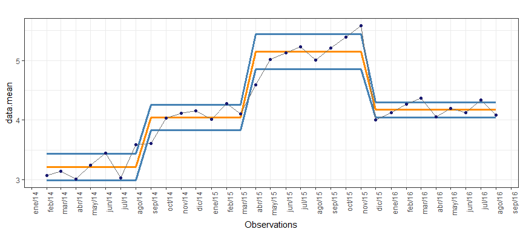

ccharter
========

Control Charts made easy. ccharter focus on calculating control systems in a series and plotting them as an overlay to it.

Installation
============

-   You can install from github with:

    ``` r
    if ( !("devtools" %in% installed.packages()) ) {
       install.packages("devtools")
    }
    devtools::install_github("jbaxx/ccharter")
    ```

Using ccharter
==============

The ccharter package comes with two main functions:

-   `ccpoints` to calculate Control Systems points from a series data frame
-   `cc2plot` to plot the Control Systems points (Control Chart)

Loading the package

``` r
library(ccharter)
```

Calculating the Control Systems points

-   An example usage of `ccpoints`:

``` r
# Create a random time series
set.seed(154)
time.series <- data.frame(t.dates = seq.Date(as.Date("2014-02-01"), as.Date("2016-08-01"), "month"),
               t.values = c(
               seq(0.1, 0.8, by = 0.1) * runif(8) + 3,
               seq(0.1, 0.7, by = 0.1) * runif(7) + 4,
               seq(0.1, 0.7, by = 0.1) * runif(7) + 5,
               seq(0.1, 0.4, by = 0.1) * runif(4) + 4,
               seq(0.1, 0.5, by = 0.1) * runif(5) + 4)
               )

# Execute function
control.chart.data <- ccpoints(time.series, "t.dates", "t.values")
```

If we inspect the object we may find it's a list consisting in the following elements:

1.  The input time series along with the calculated mean and sd for each system
2.  The name of the dates column
3.  The name of the values column
4.  The count of systems result
5.  The summary of missing values removed
6.  The reference point of last break
7.  The weeks since last break (if date values were provided)
8.  The next break expectation, above or below of current system
9.  The points remaining for a new system break

``` r
# Inspecting cchart object content
lapply(control.chart.data, head)
#> $data
#>      t.dates t.values data.mean  data.ll  data.ul
#> 1 2014-02-01 3.071129  3.217276 2.996493 3.438059
#> 2 2014-03-01 3.140564  3.217276 2.996493 3.438059
#> 3 2014-04-01 3.008430  3.217276 2.996493 3.438059
#> 4 2014-05-01 3.243547  3.217276 2.996493 3.438059
#> 5 2014-06-01 3.442773  3.217276 2.996493 3.438059
#> 6 2014-07-01 3.029862  3.217276 2.996493 3.438059
#> 
#> $dates.name
#> [1] "t.dates"
#> 
#> $values.name
#> [1] "t.values"
#> 
#> $systems_count
#> [1] 4
#> 
#> $missing_values
#> [1] NA
#> 
#> $point_last_break
#> [1] "2015-12-01"
#> 
#> $weeks_since_last_break
#> Time difference of 57 weeks
#> 
#> $next_break
#> [1] "Next system expected to break negative"
#> 
#> $next_break_values
#> Continous points vs mean:  
#>                          6
```

To extract the data frame, we can access it from the list in the following way:

``` r
control.chart.data[["data"]]
```

Plotting the Control Systems points

This is how the example series looks like:


-   An example usage of `cc2plot`:

``` r
# Passing the cchart object to the cc2plot function
cc2plot(control.chart.data)
```



For detailed functions documentation you can access the help files in R with `?ccpoints` and `?cc2plot`.

Integration with KNIME: ccharter
================================

[Here you may find a brief guide on how to integrate the package in a KNIME workflow.](https://github.com/jbaxx/ccharter/tree/master/knime)
